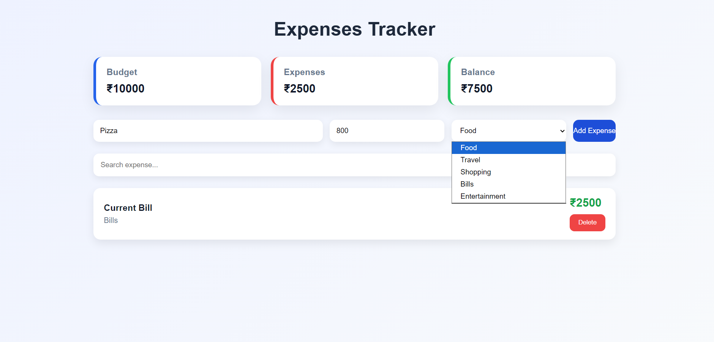

# Expense Tracker

A responsive Expense Tracker built using React that helps users manage their daily expenses efficiently. Users can add, search, and delete expenses while viewing their total budget, total expenses, and remaining balance. All data is stored using Local Storage, so expenses remain available even after refreshing the page.

## Live link:

- **https://react-expenses-tracker-seven.vercel.app/**

## Features

- Add new expenses
- Delete expenses
- Search expenses
- Budget summary
- Total expenses calculation
- Remaining balance calculation
- Local Storage support
- Responsive design

## Preview 1: (On windows/Mac)





## Preview 2: (On smart phones)


## Technologies Used

- React
- JavaScript (ES6)
- HTML5
- CSS3
- Vite

## React Concepts Used

- Components
- Props
- useState
- useEffect
- map()
- filter()
- reduce()
- Controlled Forms
- Local Storage

## Project Structure

```
src
│── components
│   ├── ExpenseForm.jsx
│   ├── Summary.jsx
│   ├── SearchBar.jsx
│   ├── ExpenseList.jsx
│   └── ExpenseItem.jsx
│
│── App.jsx
│── App.css
│── main.jsx
```

## Installation

```bash
npm install
npm run dev
```

## Future Improvements

- Edit expense
- Expense categories with icons
- Pie chart visualization
- Monthly reports
- Dark mode
- Export data

## Author

**Reshma Gandeti**

## Connect with me :

LinkedIn: https://www.linkedin.com/in/gandetireshma0927/
